# COVID-19 Analysis

## COVID-19 Overview
#### As COVID-19 persists throughout the globe, we intend to explore and determine the relationships between different factors that contribute to the spread of COVID-19 and its outcomes noted by people worldwide. The goal of analyzing these health outcomes is ultimately to predict the health outcomes in future populations based on the factors determined significantly by the machine learning model utilized below. 

The data utilized for the analysis was obtained from Our World in Data, which is an organization that focuses on researching international crises, including issues like climate change, war, and disease.  
Specifically, Our World in Data has combined data from across the world to include country, continent, new COVID-19 cases, total COVID-19 cases, population, age, and several other factors about the COVID-19 pandemic. 
By analyzing this dataset, we hope to answer questions such as: how does age affect the health outcome of someone with a COVID-19 diagnosis? What differences exist between the health outcomes of people from different countries? How can future health outcomes be predicted from this data?

In completing the exploration described above, this team has agreed upon communication protocols to ensure the success of this project:
All team members will contribute equally to the analysis by covering different aspects of the project.
Each team member will manage their git branch to this repository.
Each team member will provide constructive feedback on the work of others to ensure the cohesiveness of the project.
Each team member will maintain open communication in Slack and Zoom. 

### Purpose
Using the One World In Data (OWID) COVID-19 dataset to build machine learning regression models to predict the number of new COVID-19 cases related to the infection daily worldwide.  
Furthermore, we intend to build deep-learning regression neural networks with the exact prediction goal and assess their performance against the ensemble Balanced RandomForest algorithms. 

## Objectives
1. Create an Amazon Web Service Relational DataBase (AWS RDS).
2. Create an S3 Bucket on AWS to store the OWID COVID-19 CSV file.
3. Connect the AWS RDS to a PostgreSQL database using pgAdmin using Spark and Google Colab.
4. Perform preliminary ETL on the COVID-19 dataset in PostgreSQL.
5. Import data from SQL database into a Jupyter Notebook using SQLalchemy.
6. Manipulate & Preprocess data for the Random Forest Regression model. 
7. Build, train, and test a Balanced Random Forest regression model.
8. Perform ML model enhancement using Feature Importance and PCA, among other techniques.
9. Compile, train, and evaluate a deep-learning regression neural network model.
10. Optimize the neural network model.
11. Merge the predictions results table with the original dataset.
12. Use Tableau to build a representative dashboard of the complete analysis. 

## Resources 
- Data Sources: owid-covid-data.csv, 
- Software & Framework:Python (3.7.6) & (3.7.13), Jupyter Notebook (6.4.11), Anaconda (4.10.3) & (4.13.0), PostgreSQL (11.15-R1), pgAdmin4 (6.7), Spark (3.2.1), Visual Studio Code (1.65.0), Tableau (2022.1.2).
- Libraries & Packages: 
    - Pandas (1.3.5), matplotlib (3.5.1), NumPy (1.21.5), seaborn (0.11.2).
    - PySpark, JAVA, PostgreSQL driver, MLlib, SQLalchemy (1.4.39), psycopg2 (2.9.3),
    - Scikit-learn (1.0.2), Scikit-learn (0.23.2) for Ensemble Learning, imbalanced-learn library (0.7.0), 
    - TensorFlow (2.3.0), Keras-applications (1.0.8),  Keras-preprocessing (1.1.2). 
- Online Tools: AWS RDS, AWS S3, Tableau Dashboard [COVID-19 Analysis Dashboard](https://public.tableau.com/app/profile/richard.hamilton2558/viz/VIZ_16587125850040/COVIDStory), Google Colaboratory Notebooks, [COVID_19_Analysis GitHub Repository](https://github.com/Magzzie/COVID_19_Analysis)

## Methods & Code
### Database 
- Utilizing AWS, an RDS instance was created to access the data file located in an S3 bucket. 
- PySpark was then used to load the data and create an identifier column for the rows ("id_row"). 
- Next, the data type of the "date" column was changed to indicate the date data type accurately.
- From there, the data was split into two data frames (cases_data and demos_data) to reflect data relating to the COVID-19 cases and the data relating to the demographics of individuals diagnosed with COVID-19, respectively.
- Lastly, PySpark was used again to load the data frames into Postgres tables. 

- Using Postgres, the cases_data and demos_data tables were joined on the "id_row" column with a full outer join into the table combined_COVID_data.
- The data was filtered to only include valid countries within the location column and loaded into the table all_countries_data.
- A connection was made from the database to the next phase of analysis-the machine learning component.
Please see the ERD for the relationship between tables.
    ||
    |-|

### Data Processing
The raw data was loaded from the SQL database into a DataFrame in Jupyter Notebook to be explored and analyzed.
#### ETL for New Cases Prediction 
- The OWID COVID-19 dataset initially contained (198,846) data records organized in 67 columns between January 1st, 2020, and July 5th, 2022, when we pulled the dataset for analysis. 
- The raw metadata in the dataset included information about the total and new cases of COVID-19, total and new COVID-related deaths, hospitals' ICUs capacity and admissions, COVID-19 screening tests counts and results, numbers of vaccinations and boosters, plus rates of people vaccinated. Additionally, the dataset had various demographic, health, social, and economic criteria of the different countries.
- There were 244 unique values in the OWID COVID-19 location column initially. These included more general aggregations of locations such as the six continents, and four income levels, in addition to the geopolitical grouping into European Union, Internation, and World. 
- We Filtered the dataset excluding all the groups mentioned above, which left us with 187,317 records of 231 distinct countries/territories. 
1. **Dropping Data**: 
    - Northern Cyprus did not have a population value in the OWID COVID-19 dataset. Therefore, it was dropped, bringing the dataset down to 187,000 records.
    - We removed all COVID-19 testing data since testing policies, availability, interpretation, and reporting were sporadic and varied significantly among countries. This step decreased the number of columns from 67 to 58.
    - Next, we dropped all columns related to calculated excess_mortality since they are irrelevant to our predictions. This step decreased the number of columns from 58 to 54. 
    - Then, we dropped the columns related to Intensive Care Unit (ICU) and hospital admissions since they had very high null values (more than 85%). That had brought the number of columns down to 46. 
    - Lastly, we dropped general columns such as the 'iso_code', 'continent', and 'aged_70_older' because they contained redundant information in other columns. The final count of columns was 43.
2. **Handling Missing Values of Main Features in All Locations**: 
    - Since our goal was to predict the number of daily new cases in various locations of the world, we dropped all null values from the total_cases column and then filled the new_cases nulls with zeros: There were 7,608 missing values out of 187,000 of the total number of COVID-19 cases from all locations. These missing values either represented no positive COVID-19 cases in that location or missed reporting. Since we would construct a new column regarding the number of COVID-19 days into the pandemic, we thought it would be redundant to keep these empty records with zero values. This step decreased the number of records to 179,392.
    - By dropping the missed values from total cases, we brought the missing values of new cases down from 7,889 to only 281. These few records might have represented actual zero new cases or missed reporting. However, since the corresponding total cases count of that location was not null, it was probably the former cause. Hence, we decided to keep these records and fill them with zeros. 
        - The new_cases_smoothed column represented the past 7-day average of new COVID-19 cases. At that stage, it had 1,393 missing values. Upon further investigation, we discovered that the average was not calculated until the sixth day of the first COVID-19 cases in each location which would justify 1,150 null values for the 230 locations in the present population-based dataset. The remaining 243 missing averages could correspond with the missing new cases that we filled with zeros. Given our extensive dataset, we decided to drop all records with missing averages for the past seven days of new COVID-19 cases. That dropped the number of records to 177,999. 
    - Death-related columns would only be featured in the COVID-related deaths prediction model but not in the daily new cases prediction model.
    - In the OWID COVID-19 dataset, the column reproduction_rate: represents a real-time estimate of the effective reproduction rate (R) of COVID-19. There was no clear pattern that explains the reason for 31,175 missing values of reproduction rate when it comes to location or total_cases values; hence, we dropped the missing values of the reproduction rate since replacing them with zeros might skew the data and influence the results. This step has decreased the number of records to 148,217 and the locations to 190 from 230.
    - **Vaccinations**: Out of 148,217 records, there were only 44,719 records with reported total vaccination numbers from all 190 locations. Vaccination reports have started on 2020-12-02 till 2022-07-02. 
        - We presume that vaccination has played an integral role in the COVID-19 pandemic trajectory, and its influence may be observed in both COVID-19 cases and deaths.
        - We presume that the absence of vaccines emphasized specific trends in the pandemic; as such, vaccine initiation was expected to decrease the number of cases and covid-related deaths. Based on that, we filled the 103,498 total_vaccinations and total_vaccinations_per_hundered nulls with zeros.
        - **people_fully_vaccination** column represented the total number of people who received all doses prescribed by the initial vaccination protocol. Completing the vaccination regimen indicated a superior level of immunity against the virus. Therefore, we chose this column as a prediction feature instead of the **people_vaccinated** or **new_people_vaccinated** columns because they describe less than optimal protection against COVID-19. As such, we filled all 108,105 null values of **people_fully_vaccinated** and **people_fully_vaccinated_per_hundred** with zeros.
        - Since March 29th, 2022, vaccination data was no longer updated on a daily basis. Instead, updates afterward were only on weekdays (Monday until Friday). Because the reporting was inconsistent in many countries, even on weekdays, we have shortened the analysis window till 2022-03-29. That has decreased the records number to 129,977. 
        - The reporting of **people_vaccinated, new_vaccinations, new_people_vaccianted, new_vaccinations_smoothed, total_boosters** and their related normalized columns per million; hence we dropped them and left only total_vaccinations and people_full_vaccinated to reflect the effect of the vaccinations on the pandemic. By now, we had 34 columns in the cleaned dataset. 
    - **stringency_index**: Government Response Stringency Index is a composite measure based on nine response indicators, including school closures, workplace closures, and travel bans, rescaled to a value from 0 to 100 (100 = strictest response). There were 7,942 missing values that we filled with zeros. 
    - **population_density**: Number of people divided by land area, measured in square kilometers, most recent year available. Two thousand one hundred one missing values would have required individual calculations and time investment, so we dropped these records and continued with 127,876.
    - **median_age**: Median age of the population, UN projection for 2020. There were 4,238 missing values that we dropped and continued with 123,638.
    - **gdp_per_capita**: Gross domestic product at purchasing power parity (constant 2011 international dollars), most recent year available. We dropped 1,440 null values and continued with 122,198.
    - **extreme_poverty**: Share of the population living in extreme poverty, most recent year available since 2010. There were many missing values in this column (36,430). With the inclusion of other SES and general population metrics, we decided to drop the whole column instead of losing that number of records for information that could be implied in other variables. We continued with 33 columns. 
    - **handwashing_facilities**: Share of the population with basic handwashing facilities on premises, most recent year available. As for the extreme_poverty column, this column also had many missing values, 60,690, so we decided to drop the column and continue with 32 only. 
    - **human_development_index**: A composite index measuring average achievement in three basic dimensions of human development—a long and healthy life, knowledge, and a decent standard of living. Values for 2019, imported from [hdr.undp.org](http://hdr.undp.org/en/indicators/137506).  We previously had 710 missing values. However, dropping the nulls from the gdp_per_capita column has also removed the null values from the human_development_index. With that, we concluded the cleaning part of the ETL and continued with (122198, 32). 

### Machine Learning Model
#### Feature Engineering
1. **Date Transformation**:
    - We converted the 'date' column to a DateTime.
    - The updated date range for the cleaned data frame is from 2020-01-23 to 2022-03-28.
    - Next, we created a new column for days of COVID-19 and calculated its value from January 1st, 2020, because that is the universal start date of the pandemic. The new column would reflect the number of days into the COVID-19 pandemic for each record of cases/vaccinations/deaths. 
    - Then, we swapped the covid_days and date columns in a new DataFrame.
2. **Creating daily difference columns**:
    - To include the added daily vaccines for each location to the machine learning model's features instead of using a cumulative total number of vaccinations, we created a new column representing the difference between total daily vaccinations. Then, we normalized the daily vaccinations per 100,000 people of the population of each location using a customized function.  
    - Similarly, we created a difference column for the total daily people considered fully vaccinated on that day and normalized it per 100,000 people of the location's population using a customized function. 
    - Interestingly, we encountered negative values due to the difference calculations in the previous two steps, highlighting missed gaps in cumulative numbers' reporting. Hence, we dropped the rows of missing values that constituted a total of (6348 + 3781 = 10129), bringing the dataset down to 112,069 records for 177 countries. 
3. **Normalization**:
    - Additionally, we normalized each of the following columns (total_cases, new_cases, total_vacciantions, people_fully_vaccinated) per 100,000 people of each location's population.
    - The final count of the dataset put us at 112,069 records and 36 columns, including deaths and outcome-related unprocessed columns. 
4. **Exporting Data**:
    - We split the cleaned dataset into two data frames: one for cases prediction and another for deaths predictions. 
    - These new cleaned data files can be found here: [cases_pred.csv](https://github.com/Magzzie/COVID-19_Analysis/blob/main/Resources/cases_pred.csv), [death_pred.csv](https://github.com/Magzzie/COVID-19_Analysis/blob/main/Resources/death_pred.csv).    
5. To facilitate the machine learning model application, we split the dataset based on population and applied the model to countries with populations of 1 million and above. 
6. We created a population-based DataFrame: **mill_countries_df**: Population more than 1 million.
7. We exported the cases prediction DataFrame of 150 countries with one million+ to a CSV file that can be accessed here: [cases_1mill_pred.csv](https://github.com/Magzzie/COVID-19_Analysis/blob/main/Resources/cases_1mill_pred.csv).
8. To eliminate the influence of new COVID-19 variants that caused spikes in the number of new cases across the world with disregard to vaccinations. we created subsets of the 1 million + dataframe: one for the first 720 days of the pandemic and the second for the first 700 days. 
9. We exported the cases prediction DataFrame of 700 days and 720 days to CSV files that can be accessed here: [cases_1mill_2yr_df.csv](https://github.com/Magzzie/COVID-19_Analysis/blob/main/Resources/cases_1mill_2yr_df.csv) & [cases_1mill_700_df.csv](https://github.com/Magzzie/COVID-19_Analysis/blob/main/Resources/cases_1mill_700_df.csv).

#### Data Preprocessing 
- We created a new DataFrame that consists of the engineered columns and health metrics: 'covid_days', 'reproduction_rate', 'stringency_index', 'population_density', 'median_age', 'aged_65_older', 'gdp_per_capita','cardiovasc_death_rate', diabetes_prevalence', 'life_expectancy', 'human_development_index', 'total_cases_per_100K', 'new_cases_per_100K', 'total_vaccinations_per_100K', 'people_fully_vaccinated_per_100K', 'daily_vaccinations_per_100K', 'daily_people_fully_vaccinated_per_100K', 'population'.
- With 99,856 records and 17 columns, we visualized all the variables with a heatmap to study their correlations using the Seaborn python library.
    |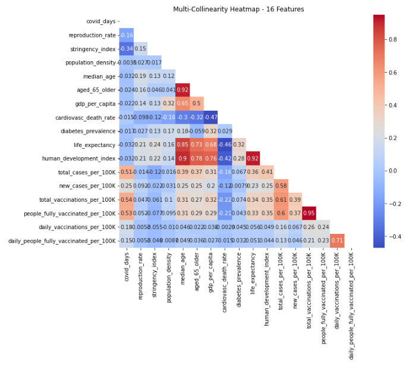|
    |-|
- Next, we defined target to be new_cases_per_100K and the rest 16 columns were the features. 
- The summary statistics for the 16 features were as follows: 
    |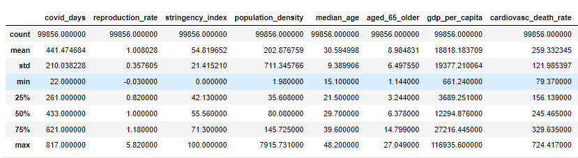| 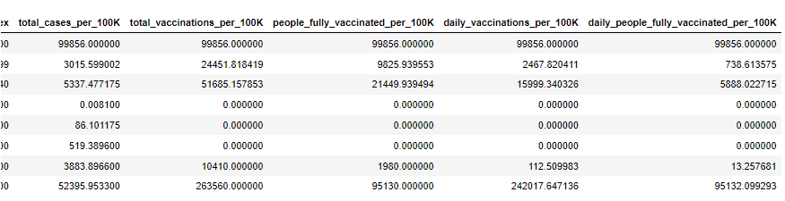|
    |-|-|
- Next, we split the data into training and testing subsets and standardized them with the StandardScaler. 
- The training and testing subsets were split according the default of 75%, 25%, respectively. X_train shape: (74892, 16), X_test shape: (24964, 16), y_train shape: (74892,), y_test shape: (24964,).

#### Creating Model
- We started by establishing a random forest regression instance and chose 128 decision trees for the first run of the model, followed by fitting and evaluating the model on the scaled training and testing data, respectively. 
- We scored the model using mean squared error, mean absolut error, and the R squared metrics. 
- Then, we used matplotlib library to visualize the predictions against the actual new cases per 100k from the testing subset, in addition to plotting the residuals of predictions for the whole *scaled* dataset. 
- Finally, we scaled the whole dataset of 16 features and made predictions on them. Then, added the predictions and calculated residuals to the [features only dataframe](https://github.com/Magzzie/COVID-19_Analysis/blob/main/Resources/pred_cases_16_features_rfr.csv) and the [dataframe with locations and raw numbers](https://github.com/Magzzie/COVID-19_Analysis/blob/main/Resources/pred_cases_16_features_all_rfr.csv).

- Next, we applied few steps to enhance the performance of the RFR: 
    1. Applying feature importance and reconstructing the RFR model based on the selected features only which entailed repeating the preprocessing steps of splitting and standardizing the data, retraining the RFR model and testing its performance on the testing subset of selected features. 
    2. Removing an outlier from the target new cases per 100K, repeating the preprocessing steps, refitting and evaluating the RFR model. 
    3. Removing features with sever collinearity as suggested by the above heatmap, repeating the preprocessing steps, refitting and evaluating the RFR model. 
    4. Increasing the number of estimators (decision trees), retraining and testing the RFR model on the 16 features preprocessed in the first step. 
    5. Applying the increased estimators on 13 features without collinear variables, retraining and testing the RFR model on the 13 features preprocessed in the thrid step of enhancements.  
    6. Using PCA technique to decrease data dimensions and applying it to all 16 features. Then, repeating the preprocessing steps, refitting and evaluating the RFR model. 
    7. Using PCA technique to decrease data dimensions and applying it to only non-colinear features (13). Then, repeating the preprocessing steps, refitting and evaluating the RFR model.  
    8. Expanding on the good test of removing outliers, we truncated the dataset back to the beginning of a severe spike in new cases per 100K at the 730 days mark, and created a new dataframe of the first 720 days into the pandemic (88,039 records, 150 countries). The split of the data was as follows: X_train shape: (66029, 16), X_test shape: (22010, 16), y_train shape: (66029,), y_test shape: (22010,). Then, we recreated an RFR model with same basic 16 features and model characteristics. 
    9. After observing the results from the previous step we truncated the days even further down to 700 days only (84,848 records of 150 countries). The split of the data was as follows: X_train shape: (63636, 16), X_test shape: (21212, 16), y_train shape: (63636,), y_test shape: (21212,). Then, we recreated an RFR model with same basic 16 features and model characteristics
    
    
    
    
    
## Results

#### Data Processing and Features
- Dates:
    - The reporting date carries significant importance in the dataset because it conveys the state of the COVID-19 pandemic in each location compared to other locations at the same timescale of the health crisis. It may also highlight chronological relations between other variables in the dataset.
    - The first announcement of COVID-19 infections was on December 31st, 2019. The World Health Organization - China Country Office was informed of several cases of pneumonia of unknown etiology (unknown cause) detected in Wuhan, Hubei Province.
    - The OneWorldInData COVID-19 data entry started on January 1st, 2020, and has been daily updated till July 4th, 2022, when we pulled the dataset from the OWID/COVID-19-data GitHub repository.
    - Although COVID-19 infections did not appear in all locations simultaneously, comparing the pandemic status across locations at the same timescale is essential. 
	- Therefore, we created a new column of days into the pandemic, starting from January 1st, 2020, which is the first report in the dataset, till the date of each record. 
However, due to inconsistencies in vaccination reporting after March 29th, 2022, we decided to shorten the analysis window to allow for optimal predictions. 
    - The analyzed time window in the cleaned dataset was between January 23rd, 2020, and March 28th, 2022. 
- There were 177 locations with complete profiles of cases, deaths, and vaccinations. 
- These locations contributed to various levels of data ranging between 6 daily records only an up to 767. 
- The COVID days on record ranged from 22 and 817 days into the pandemic. 
- Populations included in the dataset ranged from 98,728 to 1,444,216,102.
- There were 15 locations with a population less than 500K, accounting for 5,688 records ranging between 6-630 records per location.
- There were 12 locations with a population between 500K and 1 million, accounting for 6,525 records ranging from 51 to 732 records per location.
-  There were 150 countries with a population of 1 million and above, accounting for 99,856 records ranging between 279-767 per location. 
- The data subsets created based on time frames of the pandemic (700 days, 720 days) served as a concept proof of the changing nature of viral infectious diseases. 

- In the first phase of predictions, we focused on countries with a population of 1 million and above. These 150 countries have accounted for 99,856 records. 
- Correlation is often used to determine a cause-and-effect relationship between two variables. However, correlation does not necessarily imply causation. Correlation heatmaps are a type of plot that visualize the strength of relationships between numerical variables. Correlation heatmaps can be used to find potential relationships between variables and to understand the strength of these relationships. 
- We constructed a heatmap to reflect the correclation between seventeen features of interest using the Seaborn library, and found that variables such as total_vaccinations_per_100K & people_fully_vaccinated_per_100K, life_expectancy & human_development_index, median_age & human_development_index, median_age & aged_65_older, and median_age & life_expectancy were having a very strong positive correlation. While  variables such as aged_65_older & human_development_index, gdp_per_capita & human_development_index, and aged_65_older, & life_expectancy were also having a strong positive correlation but to a lesser degree. 
- Generally speaking, a Pearson correlation coefficient value greater than 0.7 indicates the presence of multicollinearity.
- Multicollinearity affects the coefficients and p-values, but it does not influence the predictions, precision of the predictions, and the goodness-of-fit statistics. Since our primary goal was to make predictions and did not need to understand the role of each independent variable, we did not see the need to reduce severe multicollinearity for the first prediction attempt.
- We ran the Random Forest Regression model on all 16 features and got a prediction score of 77%. 
- Rerunning the RFR model on selected features based on their importance to the prediction resulted in a lower testing score of 75%.
- Removing an outlier from the targer new cases per 100K positively affected the performance of the RFR model, resulting in a R squared value of 0.808 and lower MSE of 457.205.
- Although none the collinear featuers shown by the heatmap included the target feature of new cases per 100K, we chose to test their influence on the model and removed them from the features set. The features with high collinearity were: (total_vaccinations_per_100K, people_fully_vaccinated_per_100K), (life_expectancy, human_development_index), and (median_age, aged_65_older). So, we removed one of each set: people_fully_vaccinated_per_100K, human_development_index, median_age. Testing the RFR model on the reduced features (13) resulted in 77% as well. 
- Furthermore, we increased the number of decision trees used in the RFR model on the preprocessed 16 features of the first run (of 77% score), and that increased the computational time of the regression and resulted in a testing score of -23%. 
- Applying the increased estimators on 13 features without collinear variables did also consume a substantial computation time and resulted in a testing score of 77% as well. 
- Using Princinpal Component Analysis on all 16 features and on non-collinear 13 features, with and without increasing the number of decision tress in the Random Forest was worse than other enhancement techniques and did not help the model for a better fit. That was evident in the negative R squared scores we got from both attempts. 
- Truncating the records down to 720 days into the pandemic had a positive influence on the RFR model performance. While the R squared score remained at 77.4%, the mean squared error dropped significantly. 
- Truncating the records down to 700 days into the pandemic had a positive influence on the RFR model performance. While the R squared score remained at 77.4%, the mean squared error dropped significantly. 

#### Model Selection: Random Forest vs. Deep Neural Network
- Random Forest is a supervised ensemble learning model that combines decision trees to analyze input data.
- Random Forest Regressors are a type of ensemble learning model that combines multiple smaller models into a more robust and accurate model.
    - Random forest models use several weak learner algorithms (decision trees) and combine their output to make a final regression decision.
    - Structurally speaking, random forest models are very similar to their neural network counterparts.
    - Random forest models have been a staple in machine learning algorithms for many years due to their robustness and scalability.
    - Both output and feature selection of random forest models are easy to interpret and can easily handle outliers and nonlinear data.

| --- | Random Forest Regression | Deep Learning Neural Network Regression |
| --- | 

- The Random Forest Regression model was able to predict the daily number of new COVID-19 cases per 100,000 people with 77% accuracy on the testing subset. 
    |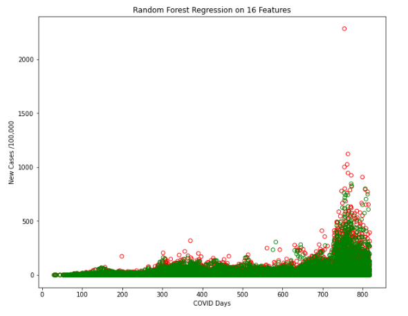|
    |-|
    |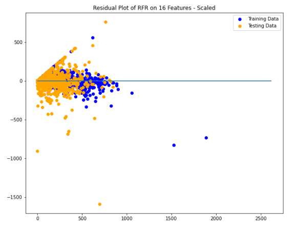| 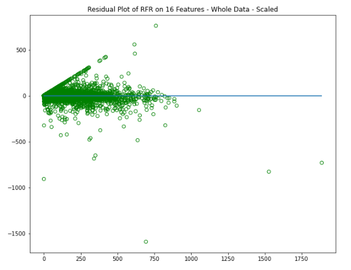|
    |-|-|
    |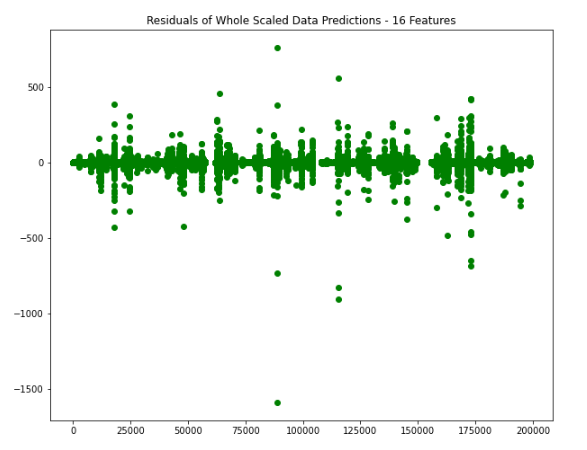|
    |-|
- Here is a sample of the Random Forest Regression prediction of new cases per 100K against the actual numbers. 
    |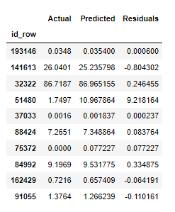|
    |-|
    
- The first run of the Random Forest Regression model on testing data with 16 features resulted in the following performance scores, knowing that the model scored 97% on the training subset: 
    - R-squared (R2 ):  0.769
    - mean absolute error (MAE):  4.781
    - mean squared error (MSE):  570.731
    - Root Mean Squared Error (RMSE):  23.890  

**Few steps were taken to enhnance the performance of the Random Forest Regression model, including:**
1. Applying feature importance technique to eliminate certain variables that were not contributing greatly to the predictions. 
    |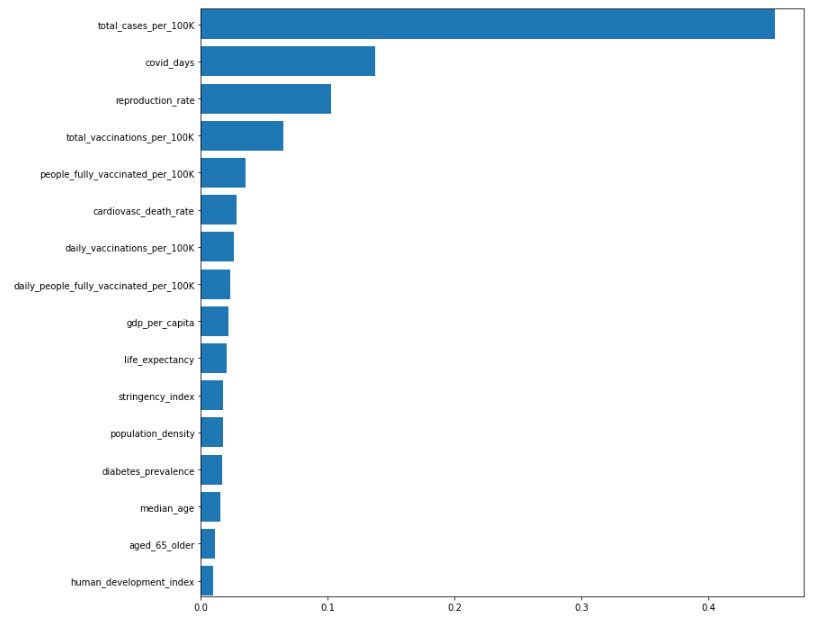|
    |-|
    - The performance scores of the RFR model predictions based on feature importance were worse than the first run: 
        - R-squared (R2 ):  0.752
        - mean absolute error (MAE):  5.951
        - mean squared error (MSE):  596.332
        - Root Mean Squared Error (RMSE):  24.420
2. Removing the maximum outlier from new_cases_per_100k did enhance the RFR model performance to 81% 
    - R-squared (R2 ):  0.808
    - mean absolute error (MAE):  4.710
    - mean squared error (MSE):  457.205
    - Root Mean Squared Error (RMSE):  21.382
3. Reducing featuers to exclude ones with sever multi-collinearity did not change the performance of the RFR model significantly. 
    - R-squared (R2 ):  0.770
    - mean absolute error (MAE):  4.777
    - mean squared error (MSE):  568.454
    - Root Mean Squared Error (RMSE):  23.842
4. Increasing the number of estimators/decision trees of the RFR model on 16 features badly influenced the model with a negative R sqaured score. A negative R2 is not a mathematical impossibility or the sign of a computer bug. It simply means that the chosen model (with its constraints) fits the data really poorly.
    - R-squared (R2 ): -0.235
    - mean absolute error (MAE):  23.307
    - mean squared error (MSE):  2972.592
    - Root Mean Squared Error (RMSE):  54.521
5. Applying the increased estimators on 13 features without collinear variables did also consume a substantial computation time but slightly increased the performance of the model. 
    - R-squared (R2 ):  0.773
    - mean absolute error (MAE):  4.751
    - mean squared error (MSE):  560.722
    - Root Mean Squared Error (RMSE):  23.680
6. Reducing data dimensions using Princinpal Component Analysis and recreating the RFR model on 16 features (including collinear features), affected the model negatively and was time consuming. 
    - R-squared (R2 ): -0.119
    - mean absolute error (MAE):  22.460
    - mean squared error (MSE):  2694.212
    - Root Mean Squared Error (RMSE):  51.906
7. Reducing data dimensions using Princinpal Component Analysis and recreating the RFR model on 13 features (excluding collinear features), in addition to increasing the decision trees from 128 to 300 also affected the model negatively and was time consuming. 
    - R-squared (R2 ): -0.613
    - mean absolute error (MAE):  24.216
    - mean squared error (MSE):  3883.128
    - Root Mean Squared Error (RMSE):  62.315
8. Truncating covid days down to 720 days preceeding a new spike in cases decreased the errors in predictions signficantly. 
    - R-squared (R2 ):  0.774
    - mean absolute error (MAE):  2.672
    - mean squared error (MSE):  94.215
    - Root Mean Squared Error (RMSE):  9.706
    |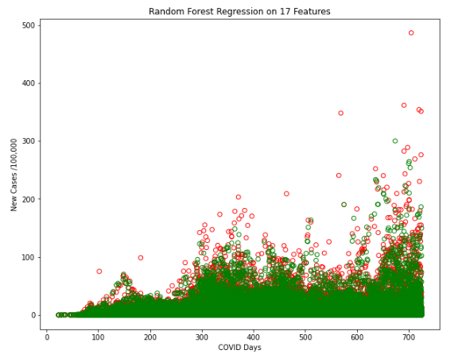|
    |-|
    |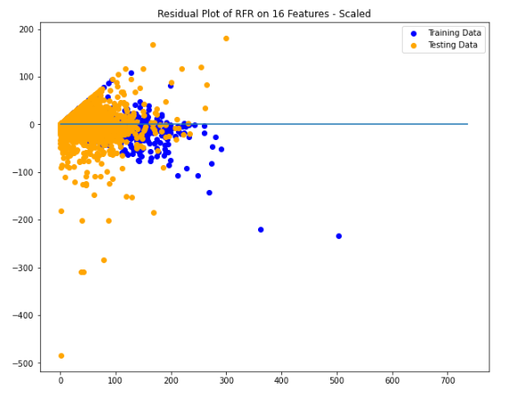| 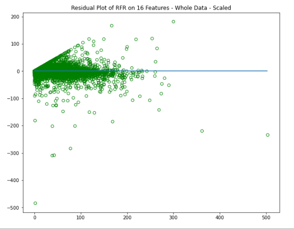|
    |-|-|
9. Truncating covid days down to 700 days to completely take out the new spike in cases decreased the errors in predictions even further. 
    - R-squared (R2 ):  0.78
    - mean absolute error (MAE):  2.62
    - mean squared error (MSE):  80.40
    - Root Mean Squared Error (RMSE):  8.97
    |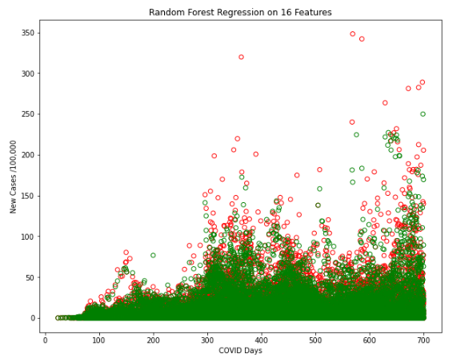| 
    |-|
    |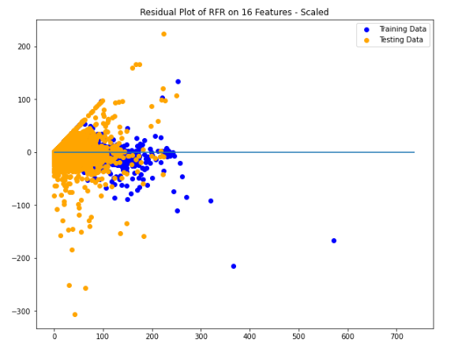| 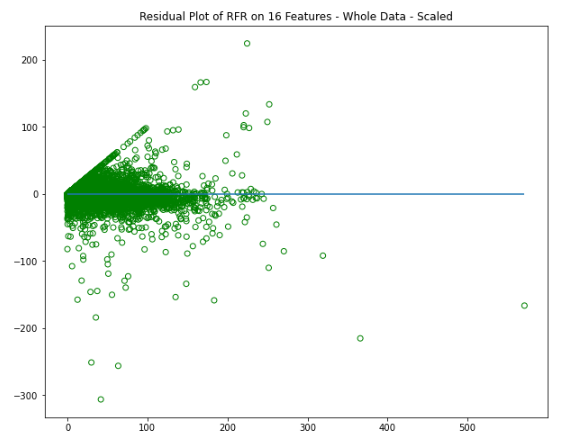|
    |-|-|

## Visualizations
Used Tableau to make representations of the cleaned cases_pred data set.
- This included a heat map of the total cases per 100K allong with various graphs of the total cases per 100K, new cases per 100K, reproduction rate, total vaccinations per 100K and daily vaccinations per 100K to show the feature importance.  
- Then new cases per 100K was ploted against new cases per 100K predictions to see how the predicted data did comparied to the actual data.  
- Because of a spike in the data two more graphs were made with the model using truncated date, one going from the original 817 covid days to 725 covid days and the other going to 700 covid days.  
- Lastly a heat maps were made comparing the predicted and actual values of the new cases per 100K. 
Included tableau work book. [COVID-19 Analysis Dashboard](https://public.tableau.com/app/profile/richard.hamilton2558/viz/VIZ_16587125850040/Story1?publish=yes)

## COVID-19 Analysis Summary
1. We were able to predict the daily number of new COVID-19 cases in 150 countries across the world using Random Forest Regression models with ranging accuracy from 77% to 81%. 
2. We attempted different techniques to enhance the model including selecting features based on importance, dropping features with severe multicollinearity, increasing the number of decision trees, and reducing the dimension of the data using Principal Component Analysis. 
3. Not all enhancement techniques were beneficial. 
4. Changing the time frame of the analysis and escaping new spikes in the pandemic had steady positive effects on predictions. Insinuating the changing nature of the pandemic due to the rise of new COVID-19 variants that were not accounted for in the original dataset. 
5. The change in the nature of the virus with every new wave might have confused the model that depended on steady factors like protective public health measures including vaccinations. 
6. At the beginning of the pandemic, the vaccinations were directed as neutralizing immunity against the virus which showed on the prediction pattern of new cases. However, later on in the course of the pandemic and as new variants of COVID-19 emerged, the effects of the vaccinations might have been diluted. 
7. Deep Learning Neural Networks were very computationally expensive and did not provide superiority to Random Forest Regression models. 
8. There were severe limitations to the dataset, including but not limited to huge gaps in reporting between locations, inconsistent calculations, and absent important informations such as public adherence to protective measures. 
9. Further analysis is recommended on separate countries to further evaluate the weaknesses of the collective dataset. 

[The Complete Analysis PowerPoint](https://github.com/Magzzie/COVID-19_Analysis/blob/main/COVID-19%20Analysis.pptx)
---
